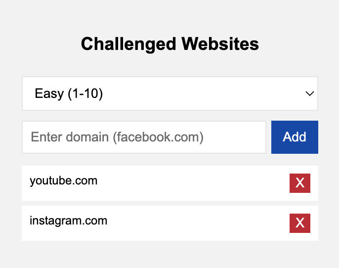
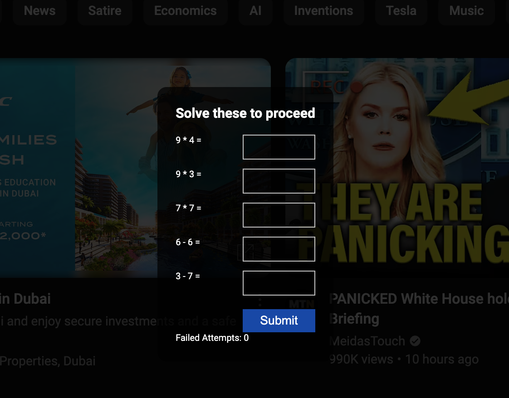

# Brain Bouncer

Brain Bouncer is a Chrome extension that helps you stay focused by requiring you to solve math problems before accessing potentially distracting websites. Once you solve the challenge, you get 30 minutes of uninterrupted access to the site.

## Features

- Block distracting websites with math challenges
- Three difficulty levels for math problems
- 30-minute access period after solving challenges
- Easy domain management through popup interface
- Customizable difficulty settings

## Installation

1. Download or clone this repository
2. Open Chrome and go to `chrome://extensions/`
3. Enable "Developer mode" in the top right
4. Click "Load unpacked" and select the extension directory

## How to Use

### Adding Websites to Block

1. Click the Brain Bouncer icon in your Chrome toolbar
2. Enter the domain (e.g., "facebook.com") in the input field
3. Click "Add" to add the domain to your blocked list
4. The domain will appear in the list below with an "X" button to remove it if needed

### Setting Difficulty

Choose your preferred difficulty level from the dropdown menu:

- Easy: Numbers between 1-10
- Medium: Numbers between 10-50
- Hard: Numbers between 50-100

### Accessing Blocked Sites

1. When you visit a blocked site, you'll see a math challenge
2. Solve all five math problems correctly
3. Click "Submit" to verify your answers
4. If correct, you'll get 30 minutes of access to the site
5. After 30 minutes, you'll need to solve new problems to continue accessing the site

### Managing Blocked Sites

- To remove a site from the blocked list, click the "X" button next to it in the popup
- Your blocked sites list and settings persist even when you close the browser

## Tips

- Use the extension for sites that tend to distract you the most
- The 30-minute timer helps balance productivity with reasonable access
- Wrong answers will be highlighted in red for quick feedback
- Failed attempts are tracked to help you monitor your progress

## Privacy

Brain Bouncer operates entirely on your local machine and doesn't collect or transmit any data. Your blocked sites list and settings are stored in Chrome's local storage.
